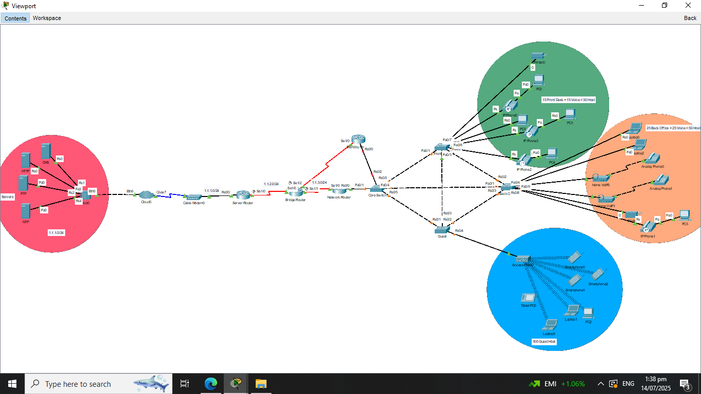

# IT-Networking-Small-Business-Neywork

## Description
This project demonstrates a complete network topology setup using:
- **3 Router**
- **4 Switches**
- **End Devices**

The configuration includes **Dynamic Host Configuration Protocol (DHCP)**, **Voice and Data VLANs**, and **Telephony (VoIP)**, **OSPf** , **HSRP**,and **Port Security**. Designed and simulated using **Cisco Packet Tracer**, this setup is ideal for Implementing the past projects in real life topology or infrastructure.

---

## Project Objectives
- Implement Networking Configurations for Real Life Network Topology 
- Troubleshoot issues if needed
- Test connection between devices
---

## Repository Contents

# Configurations/
- **Server Router.txt**
- **Bridge Router.txt**
- **Network Router.txt**
- **Standby Router.txt**
- **Core Switch.txt**
- **Front Desk.txt**
- **Back Office.txt**
- **Guest.txt**

# IT Networking Source File/
- **IT Network 3 (Small Business Network).pkt**

# Overview

# README.md

## Tools Used
- **Cisco Packet Tracer** – for simulation and design
- **Text Editor** – for writing and reviewing CLI configs

---

## How to Use
1. Open the `IT Network 3 (Small Business Network).pkt` file using **Cisco Packet Tracer**.
2. Check Network devices if they have DHCP, VLANs, and Telephony.
3. Analyze the Topology and try to ping each devices.
4. Test communication via IP Phones across the network.
5. Try to access web server using it-web.ph in End devices using Browser
---

## Author
**[ITArchitect111](https://github.com/ITArchitect111)**  
BS in Information Systems – Isabela, Philippines  
**TikTok**: [@it_ako123](https://www.tiktok.com/@it_ako123)

---

## License
This project is provided for educational purposes only.  
Feel free to fork or adapt it with proper credit.
